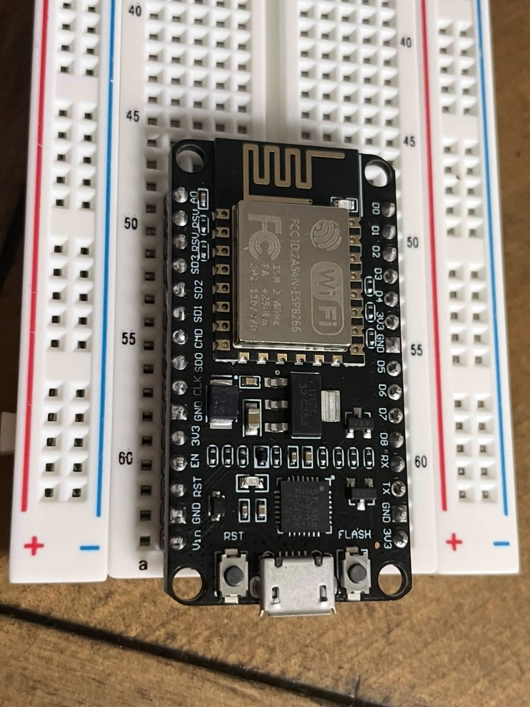

## MILESTONE ONE
**GOAL: CREATE ARDUINO CLOUD ACCOUNT, SETUP A 'HELLO WORLD' WITH YOUR MCU BOARD.**

- [CREATE ACCOUNT](https://login.arduino.cc/login)
- [ARDUINO ESP32 DOCS](https://docs.arduino.cc/arduino-cloud/guides/esp32/)
- TOP RIGHT BROWSER:
	- Go to Arduino Cloud -> 

- -> DEVICES ON LEFT NAV BAR
- -> CLICK 

- -> SELECT THIRD PARTY DEVICE
- -> SETUP DEVICE MODAL
	- ESP8266 SELECT
	- NodeMCU 1.0 (ESP-12E Module)
	- Continue...
- -> GIVE YOUR DEVICE A NAME
	- NEXT
- *IMPORTANT*
	- -> SAVE ID
	- -> SAVE SECRET KEY
	- -> (DOWNLOAD PDF)
	- CONFIRM SAVED + CONTINUE
- DONE

## Create a Thing

- THING == VIRUTAL TWIN OF HARDWARE
	- FOR SYHNCING BETWEEN CLOUD AND THE BOARD
- THINGS (left NAVBAR)
	- -> CLICK CREATE A THING
- -> ASSOCIATED DEVICE TOP RIGHT
- -> CLICK THE LINK ICON
	- MODAL: -> SELECT THE DEVICE YOU NAMED IN PREV. STEP

## Create a Cloud Variable

- CLICK "ADD" Middle Top
- "Add Variable" MODAL
	- -> ENTER A NAME
		- This will be a BOOLEAN VARIABLE in your CODE
	- LEAVE EVERYTHING DEFAULT*
	- -> CLICK "Add Variable" BUTTON

## Code (Sketch)

- `.ino` is your `Main` program file

## Install Agent

- -> NAVIGATE BACK TO YOUR WEB BROWSER
- -> DOWNLOAD cloud.arduino.cc/download-agent
- -> NAVIGATE TO THE [DOCS](https://docs.arduino.cc/arduino-cloud/guides/esp32/)
- FOLLOW COMPILE & UPLOAD STEP

## Back to Things

- SETUP NETWORK
- NAVIGATE TO THINGS (LEFT SIDE NAV BAR) in CLOUD INTERFACE (not dashboard?)
- -> CLICK ON YOUR THING
- -> RIGHT NAVBAR UNDER "NETWORK"
	- CLICK "LINK" CONFIGURE/CHANGE ICON
- -> HARDCODE WIFI NETWORK AND PASSWORD INTO DEVICE

## MCU BOARD PLACEMENT

- PUT THE BOARD ON THE BREADBOARD WITH THE USB ALIGNED WITH THE SIDE OF THE BREADBOARD WHERE THE BREADBOARD NUMBERS ARE THE HIGHEST

  

## Hello World

- STILL INSIDE THE THING
- OPEN SKETCH TAB (TOP RIGHT)
- FAR LEFT VERTICAL NAV BAR
	- CLICK EXAMPLES BUTTON
	- SEARCH FOR "BLINK"
	- CLICK "BLINK"
- SELECT BOARD TOP CENTER ("same as last time"?)
	- -> BOARD NAME: "NodeMCU 1.0"
-  -> TOP LEFT CLICK the ARROW ->
	- "UPLOAD" BUTTON

## Code (Sketch) (READY TO DEVELOP)

- BACK TO "THING"
- **CODE**

 

[NEXT MILESTONE](./2-MILESTONE.md)
