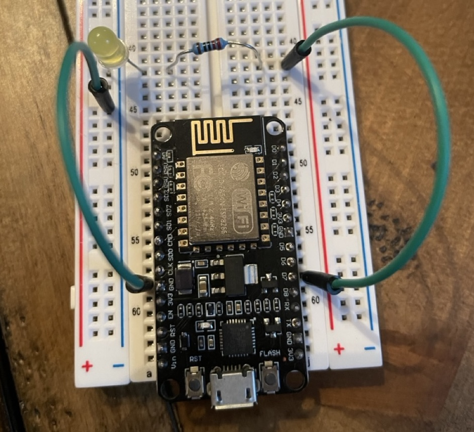
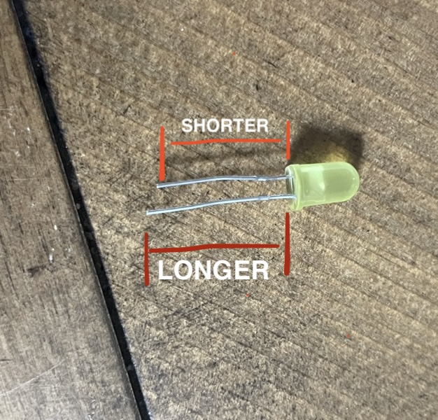

[PREV MILESTONE](./2-MILESTONE.md)

## MILESTONE THREE
**GOAL: TOGGLE AN LED LIGHT VIA THE CLOUD DASHBOARD**

HARDWARE SPECS:
- 1 LED
- 1 RESISTOR - VALUE: 200 - 300 ohms
- 2 CONNECTING WIRE
  
 

1. *CONNECT LED TO GROUND*
     - the LED is polarized so current can only flow in one direction (a "diode")
     - if you have LED backwards it will not work
  
	<ol type="a">
	<li>connect LED's long side to a terminal strip</li>
	<li>connect LED's short side to ground power rail</li>
	<li>use connecting wire to connect ground power rail to ground pin on MCU board </li>
	</ol>

	

2. *CONNECT POWER AND RESISTOR TO LED*
     - the LED cannot regulate current on its own, so we use a resistor to lower the current
   - without the resistor, the high current would destroy the LED

	<ol type="a">
	<li>place a resistor pin in the same terminal strip that the LED pin is in, and connect the other resistor pin in a different terminal strip. (in the picture, we use the strip directly across the dip)</li>
	<li>use connecting wire to connect strip one of the MCU board's data pins (in the picture, we use d7) </li>
	</ol>

 

- **CODE**
	- TODO: `SET THE MODE OF The PIN WE ARE USING IN THE SETUP FUNCTION`
	- `USE EVENT LISTENER TO LISTEN TO EVENTS FROM CLOUD AND RESPOND TO THEM`
		- (IF `isOn` (your `bool` variable) is TRUE turn on LED, ELSE turn off)

 

[NEXT MILESTONE](./4-MILESTONE.md)
