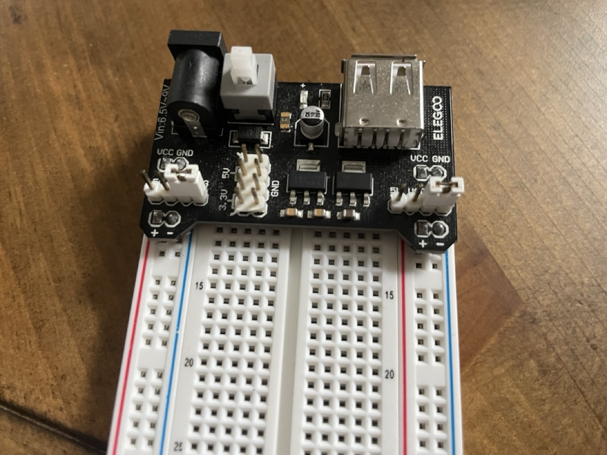
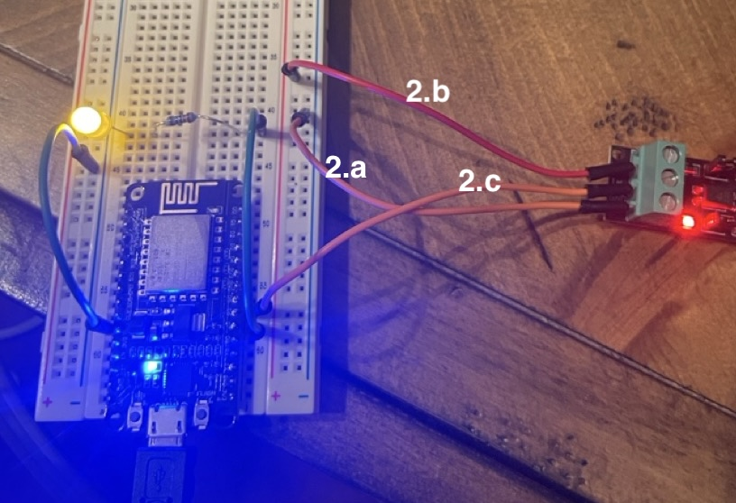

[PREV MILESTONE](./3-MILESTONE.md)

## MILESTONE FOUR
**GOAL: ADD A RELAY AND ITS POWER SUPPLY**

HARDWARE SPECS:
- 1 POWER SUPPLY
- 1 RELAY
- 3 CONNECTING WIRES
- BATTERY ADAPTER

 

- *ATTACH POWER SUPPLY*

    

 

- *CONNECT WIRES*
	<ol type="a">
	<li>connect breadboard-rail-ground to relay-grn</li>
	<li>connect breadboard-positive to relay-vcc</li>
	<li>connect data pin (d6) goes into relay-in</li>
	</ol>

    

 

- *CONNECT 9V BATTERY TO THE POWER SUPPLY*
	<ol type="a">
	<li>connect the battery to the battery adapter</li>
	<li>use the battery adapter to make the connection between the power supply and the battery</li>
	<li>(double check +/- going into relay correctly)</li>
	<li>turn on the power supply with the physical button located on the power supply</li>
	<li>confirm you hear a clicking sound</li>
	</ol>

 

- `CODE`\
  - TODO: `EDIT EVENT HANDLER TO TRIGGER THE RELAY`

 

[NEXT MILESTONE](./6-MILESTONE.md)
