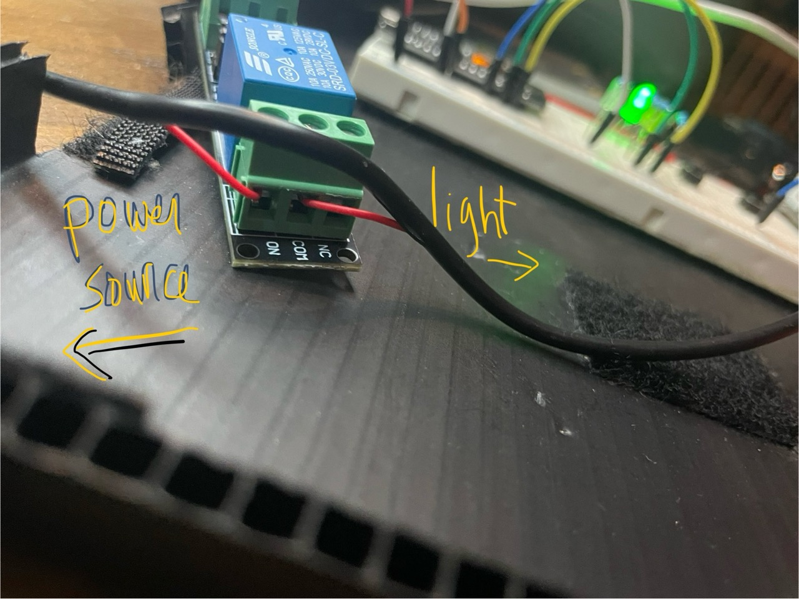

[PREV MILESTONE](./4-MILESTONE.md)

## MILESTONE FIVE
**GOAL: SPLICE THE RELAY INTO THE LAMP CIRCUIT**

HARDWARE SPECS:
- 1 LAMP

 

 

1. *MAKE A 2"-3" SLICE HALF WAY INTO THE LAMP POWER CORD JACKET*
	- (between power switch and usb connector)
	- (don't cut into wire only plastic jacket)
2. *PULL OUT RED WIRE*
	<ol type="a">
	<li>cut this wire in the middle (in half)</li>
	<li>strip 1/4" of jacket away on each end</li>
	</ol>
3. *INSERT THE NEW EXPOSED ENDS OF RED WIRE INTO RELAY*
	<ol type="a">
	<li>usb side goes into "on"</li>
	<li>power switch side goes into "common"</li>
	</ol>

4. *PLUG THE LAMP INTO POWER*
    - confirm the lamp powers on when relay powers on
    - if not working, check the power switch for the lamp is turned on

 

[NEXT MILESTONE](./6-MILESTONE.md)
